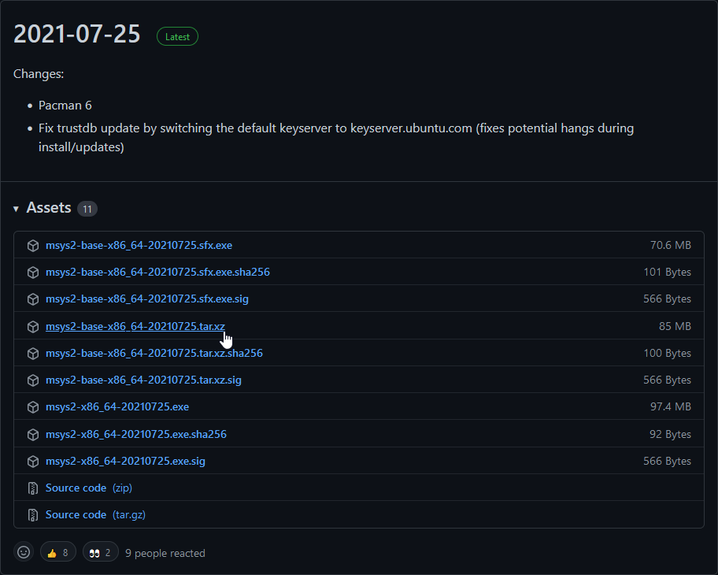
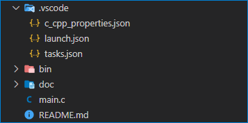
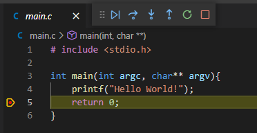

# How to develop a 64bit C application on Windows 10 with Visual Studio Code

## Introduction

Every time I wanted to develop a C application on Windows I had a hard time setting up the development environment. This is why I wrote this tutorial.

## Stuff you need

Fist the quick links to the resources:

* [Msys2](https://github.com/msys2/msys2-installer/releases)
* [Visual Studio Code](https://code.visualstudio.com/download)

Now the installation hints.

I prefer to use the tar.xz archive, but I guess you can use the installer as well. I will just provide information on where I have the stuff located on my harddrive in order for the project to work. If you have it somewhere else you may have to adjust the path variables in the json files aftwards.



I have extracted the contents of the archive to the following directory (PowerShell syntax):

```powershell
${env:LocalAppData}\Programs\Msys2
```

Or in CMD and Windows Explorer:

```
%LocalAppData%\Programs\Msys2
```

When everything is extracted there, the Msys2 shell can be launched like this:

```
%LocalAppData%\Programs\Msys2\mingw64.exe
```

Then some initial setup steps are executed. I am not going to show a screenshot here because this is not importand and only appears on first launch. When shown in the the terminal window the program has to be closed by typing "exit" and confirming with [ENTER]. Then it has to be reopened and the required tools can be installed with the following command:

```bash
pacman -S mingw-w64-x86_64-gdb mingw-w64-x86_64-gcc mingw-w64-x86_64-openssl mingw-w64-x86_64-make
```

**After this the  tooling is installed in the mentioned directory.**

## Stuff to set up

Now to the interesting part: The setup.

### VS Code

The configuration of "Visual Studio Code" is done completely in the ".vscode" folder and does not contain any user information, like username or home directory, if you stick to this tutorial.

The whole configuration consists of three files:



* c_cpp_properties.json: Defines where to find include directories, files, etc.
* launch.json: Defines what happens if "F5" is pressed in VS Code (Debug file)
* tasks.json: Defines how to build the porject

In this case these three files have the following contents.

**c_cpp_properties.json**

```json
{
    "configurations": [
        {
            "name": "Win32",
            "includePath": [
                "${workspaceFolder}/**",
                "${env:LocalAppData}/Programs/Msys2/**"
            ],
            "defines": [
                "_DEBUG",
                "UNICODE",
                "_UNICODE"
            ],
            "cStandard": "c17",
            "cppStandard": "c++17",
            "intelliSenseMode": "gcc-x64"
        }
    ],
    "version": 4
}
```

**launch.json**

```json
{
    "version": "0.2.0",
    "configurations": [

        {
            "name": "(gdb) Launch",
            "type": "cppdbg",
            "request": "launch",
            "program": "${workspaceFolder}/bin/main.exe",
            "args": [],
            "stopAtEntry": false,
            "cwd": "${workspaceFolder}/bin",
            "environment": [
                {
                    "name": "PATH",
                    "value":  "${env:PATH};${env:LocalAppData}/Programs/Msys2/mingw64/bin;${env:LocalAppData}/Programs/Msys2/usr/bin"
                }
            ],
            "externalConsole": false,
            "MIMode": "gdb",
            "miDebuggerPath": "${env:LocalAppData}/Programs/Msys2/mingw64/bin/gdb.exe",
            "setupCommands": [
                {
                    "description": "Enable pretty-printing for gdb",
                    "text": "-enable-pretty-printing",
                    "ignoreFailures": true
                }
            ],
            "preLaunchTask": "build"
        }
    ]
}
```

**tasks.json**

```json
{
    "version": "2.0.0",
    "tasks": [
        {
            "label": "build",
            "type": "shell",
            "command": "gcc.exe -g -o bin/main.exe main.c",
            "problemMatcher": [],
            "options": {
                "cwd": "${workspaceFolder}",
                "env": {
                    "PATH": "${env:PATH};${env:LocalAppData}/Programs/Msys2/mingw64/bin;${env:LocalAppData}/Programs/Msys2/usr/bin"
                }
            }
        }
    ]
}
```

As you can see the directory `${env:LocalAppData}/Programs/Msys2` is referenced in all these files. This is where the compiler collection is located. The environment variable is replaced in the background.

The only thing left to do is to create a directory "bin" for the output and a file containing the C source code:

```c
# include <stdio.h>

int main(int argc, char** argv){
    printf("Hello World!");
    return 0;
}
```

When opening the file, adding a breakpoint and pressing "F5" the application should be compiled, started and halted at the shown position:

